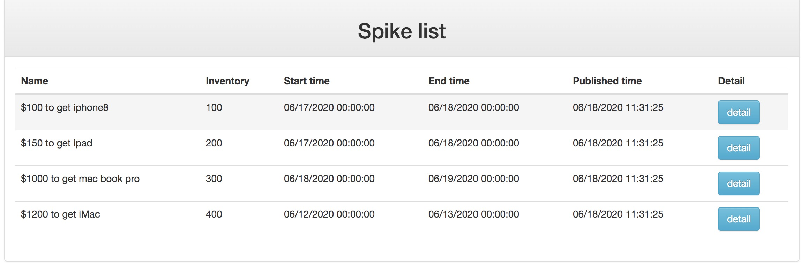

# Spike
This is a web based spike system.

Use ssm framework and maven to manage the project.

Use redis to handle high concurrency.

Use mysql as a database management system.

Use md5 to encrypt the spike url.

Front-end use jquery and simple jsp.

